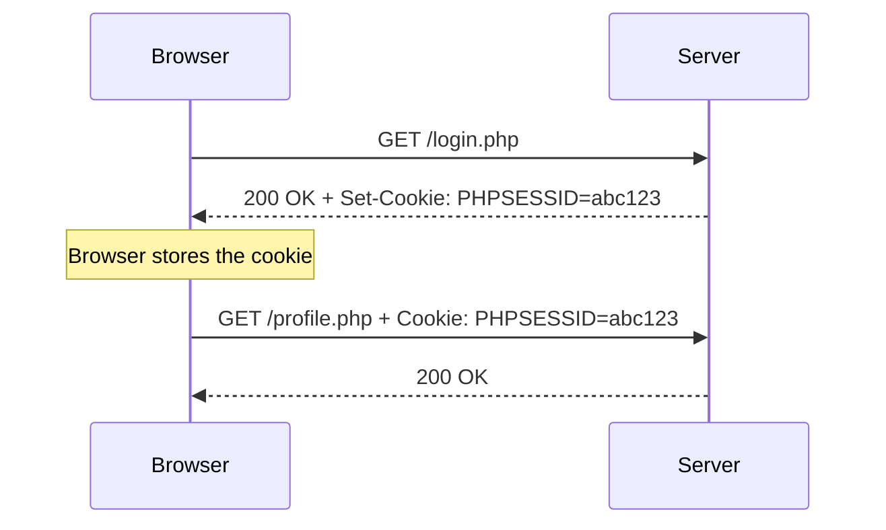
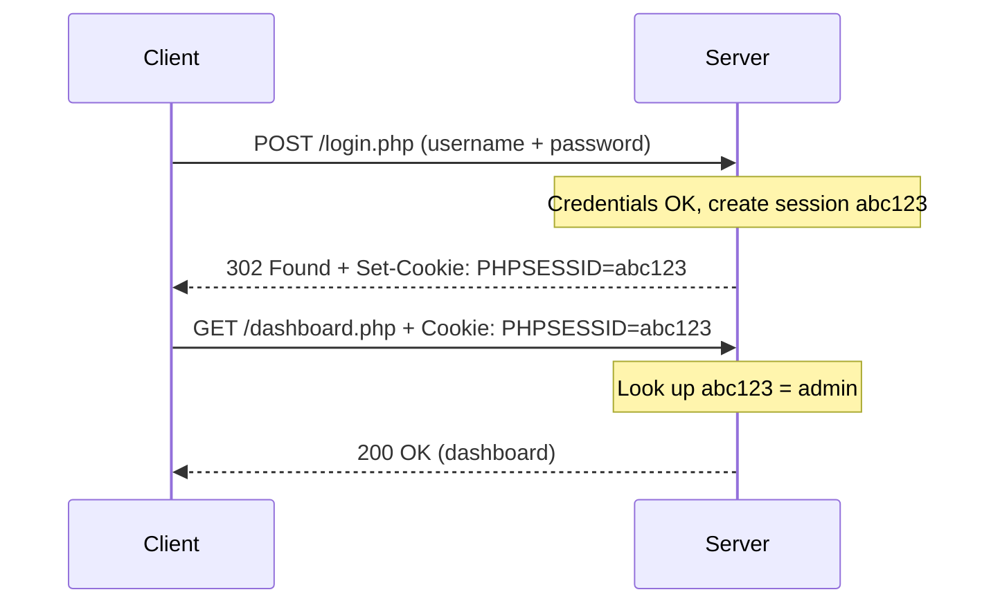

# cURL & HTTP Requests — Study Notes

Beginner-friendly revision notes for the **HTB Academy – Web Requests** module.
Simple English, with short Egyptian Arabic notes (**بالمصري**) where they help.

> [!NOTE]
> All examples target `localhost`, `example.com`, or an authorized HTB lab (`SERVER_IP:PORT`).
> Practice only on systems you are allowed to test.

---

## Contents

| Part | Topics |
| ---- | ------ |
| **1. Basics** | [cURL](#1-what-is-curl) · [HTTP request](#2-what-is-an-http-request) · [Methods](#3-http-methods) · [Status codes](#4-http-status-codes) |
| **2. cURL options** | [`-X`](#5-choose-the-method--x) · [`-d`](#6-send-data--d) · [`-H`](#7-add-headers--h) · [`-b`](#8-send-cookies--b) · [`-c`](#9-save-cookies--c) · [`-i`](#10-show-response-headers--i) · [`-v`](#11-verbose-mode--v) · [`-s`](#12-silent-mode--s) · [`-o`](#13-save-output--o) |
| **3. Web concepts** | [Cookies](#14-cookies) · [Sessions](#15-sessions) · [JSON](#16-json) · [GET parameters](#17-get-parameters) · [POST data](#18-post-data) · [JSON POST](#19-json-post-requests) |
| **4. Browser → cURL** | [DevTools](#20-inspecting-requests-with-devtools) · [Copy as cURL](#21-copy-as-curl) · [Fetch API](#22-fetch-api) · [Reproducing a request](#23-reproducing-a-browser-request) · [Full example](#24-full-example-breakdown) · [Workflow](#25-the-workflow) |
| **5. Revision** | [Options table](#26-most-important-curl-options) · [`-b` vs `-c`](#27--b-vs--c--must-remember) · [Mental model](#28-mental-model) · [Quick revision](#29-quick-revision) · [Practice](#30-practice-questions) |

---

# Part 1 — Basics

## 1. What is cURL?

**cURL** (*Client URL*) is a command-line tool that **sends a request to a URL and prints the response**.

> **بالمصري:** cURL بيعمل نفس اللي المتصفح بيعمله (يبعت request ويستلم response)، بس من الـ terminal ومن غير واجهة.

```bash
curl http://example.com
```

This sends a **GET** request and prints the page's HTML.

**Why not just use the browser?**

| Browser | cURL |
| ------- | ---- |
| Hides most details | Shows exactly what is sent and received |
| Hard to change one part of a request | Easy to change method, headers, cookies, body |
| Manual clicks | Repeatable commands and scripts |

> [!WARNING]
> **Windows PowerShell:** `curl` is an alias for `Invoke-WebRequest`, a different tool. Type `curl.exe` to run the real cURL.

---

## 2. What is an HTTP Request?

**HTTP** is the language browsers and servers use to talk.

- **Request** → sent by the **client** (browser or cURL) to the **server**
- **Response** → sent back by the **server**

> **بالمصري:** الـ request هو الطلب اللي بتقوله للكاشير، والـ response هو اللي بيرجعلك.

### A request

```http
POST /search.php HTTP/1.1          ← method, path, version
Host: example.com                  ← headers
Content-Type: application/json
Cookie: PHPSESSID=abc123
                                   ← empty line
{"search":"london"}                ← body (optional)
```

| Part | Meaning |
| ---- | ------- |
| **Method** | The action you want (GET, POST, …) |
| **Path / URL** | The resource you are talking to |
| **Headers** | Extra information about the request (`Name: value`) |
| **Body** | The data you send (not every request has one) |

### A response

```http
HTTP/1.1 200 OK                    ← version, status code, message
Content-Type: text/html            ← headers
Set-Cookie: PHPSESSID=abc123

<html>...</html>                   ← body
```

> [!TIP]
> An **endpoint** is a specific URL that does one job, like `/search.php` or `/api/users`.

---

## 3. HTTP Methods

The **method** tells the server what you want to do.

| Method | Purpose | Usually has a body? |
| ------ | ------- | ------------------- |
| `GET` | Read data | No |
| `POST` | Send / create data | Yes |
| `PUT` | Update / replace data | Yes |
| `DELETE` | Delete data | No |

```bash
curl http://localhost/api/cities                       # GET (default)
curl -X POST -d 'name=cairo' http://localhost/api/cities
curl -X PUT -H 'Content-Type: application/json' -d '{"name":"giza"}' http://localhost/api/cities/1
curl -X DELETE http://localhost/api/cities/1
```

> [!TIP]
> In APIs these match **CRUD**: **C**reate = POST, **R**ead = GET, **U**pdate = PUT, **D**elete = DELETE.

---

## 4. HTTP Status Codes

A **status code** is the 3-digit number in the response that says what happened.
**The first digit tells you the category.**

| Range | Category | Meaning |
| ----- | -------- | ------- |
| `1xx` | Informational | "Received, continue" |
| `2xx` | Success | It worked |
| `3xx` | Redirection | Go to another URL |
| `4xx` | Client error | Something is wrong with **your request** |
| `5xx` | Server error | Something broke **on the server** |

### Codes to remember

| Code | Name | Typical situation |
| ---- | ---- | ----------------- |
| `200` | OK | Request succeeded |
| `201` | Created | Something new was created (common after POST/PUT) |
| `301` | Moved Permanently | Page moved for good (check the `Location` header) |
| `302` | Found | Temporary redirect, very common right after login |
| `400` | Bad Request | Malformed request, such as broken JSON |
| `401` | Unauthorized | You are **not authenticated** (not logged in) |
| `403` | Forbidden | You are known, but **not allowed** |
| `404` | Not Found | The page or endpoint doesn't exist |
| `500` | Internal Server Error | The server's code crashed |

> [!IMPORTANT]
> **401 vs 403**
> - `401` → "Who are you?" Log in first.
> - `403` → "I know who you are, but no." Logging in won't help.

> [!TIP]
> cURL does **not** follow redirects by default. Add `-L` to follow them.

---

# Part 2 — cURL Options

## 5. Choose the Method (`-X`)

`-X` sets the HTTP method.

```bash
curl -X GET    http://localhost/api/users
curl -X POST   http://localhost/api/users
curl -X PUT    http://localhost/api/users/5
curl -X DELETE http://localhost/api/users/5
```

| You write | Method used |
| --------- | ----------- |
| No `-X`, no `-d` | `GET` |
| `-d` with no `-X` | `POST`, chosen automatically |
| `-X PUT` | `PUT` |

> **بالمصري:** لو حطيت `-d` من غير `-X`، cURL بيعتبره POST لوحده. كتابة `-X POST` بتخلي الأمر أوضح بس.

---

## 6. Send Data (`-d`)

`-d` puts data in the **request body**: the part of the request after the headers that carries your data.

### Form data

```bash
curl -d 'username=admin&password=admin' http://localhost/login.php
```

- Format: `key=value` pairs joined with `&`
- cURL adds `Content-Type: application/x-www-form-urlencoded` (the format HTML forms use)

Several `-d` flags are joined with `&`:

```bash
curl -d 'username=admin' -d 'password=admin' http://localhost/login.php
# body → username=admin&password=admin
```

### JSON

```bash
curl -d '{"search":"london"}' -H 'Content-Type: application/json' http://localhost/search.php
```

> [!IMPORTANT]
> `-d` doesn't know your data is JSON. Without `-H 'Content-Type: application/json'`, the server is told it's form data and may ignore it.

### From a file

```bash
curl -d @body.json -H 'Content-Type: application/json' http://localhost/api
```

`@filename` reads the body from a file.

---

## 7. Add Headers (`-H`)

`-H` adds a header: one `Name: value` line of extra information.

```bash
curl -H 'Accept: application/json' -H 'User-Agent: MyTool/1.0' http://localhost/api
```

You can repeat `-H` as many times as you need.

### Common headers

| Header | Meaning |
| ------ | ------- |
| `Host` | Which website (cURL adds it for you) |
| `User-Agent` | Which client is sending the request |
| `Content-Type` | **Format of the body you are sending** |
| `Accept` | Format you want back |
| `Cookie` | Cookies you are sending |
| `Authorization` | Credentials or tokens |

### `Content-Type`

| Value | Body looks like |
| ----- | --------------- |
| `application/x-www-form-urlencoded` | `city=london&page=1` |
| `application/json` | `{"city":"london","page":1}` |
| `multipart/form-data` | File uploads |

> [!TIP]
> A `\` at the end of a line means "the command continues on the next line". It only makes long commands easier to read.

---

## 8. Send Cookies (`-b`)

`-b` **sends cookies** to the server by adding a `Cookie:` header.

```bash
curl -b 'PHPSESSID=abc123' http://localhost/profile.php                 # one cookie
curl -b 'PHPSESSID=abc123; theme=dark' http://localhost/profile.php     # several
curl -b cookies.txt http://localhost/profile.php                        # from a file
```

If the text contains `=`, cURL treats it as a cookie value. Otherwise it treats it as a file name.

This does the same thing as setting the header yourself:

```bash
curl -H 'Cookie: PHPSESSID=abc123' http://localhost/profile.php
```

**`PHPSESSID`** is PHP's default session cookie name. Its value is your session ID, which is how the server knows you're logged in. See [Sessions](#15-sessions).

---

## 9. Save Cookies (`-c`)

`-c` **saves the cookies the server sends you** (from `Set-Cookie`) into a file.

```bash
# log in and save the session cookie
curl -c cookies.txt -d 'username=admin&password=admin' http://localhost/login.php

# reuse it
curl -b cookies.txt http://localhost/dashboard.php
```

| Option | Direction | Memory trick |
| ------ | --------- | ------------ |
| `-c file` | Server → file | **C**ollect |
| `-b file` | File → server | **B**ring |

> **بالمصري:** `-c` = خزّن الكوكيز اللي السيرفر إداهالك. `-b` = ابعت الكوكيز للسيرفر.

Full explanation: [`-b` vs `-c` — MUST REMEMBER](#27--b-vs--c--must-remember)

---

## 10. Show Response Headers (`-i`)

By default cURL prints **only the body**. `-i` prints the **response headers and the body**.

```bash
curl -i http://localhost/
```

```http
HTTP/1.1 200 OK
Server: Apache
Set-Cookie: PHPSESSID=abc123; path=/
Content-Type: text/html; charset=UTF-8

<html>...</html>
```

Use it to see the **status code**, `Set-Cookie`, `Location` (redirects), and `Content-Type`.

> [!TIP]
> `-I` (capital i) is different: it sends a **HEAD** request and returns headers only, with no body.

---

## 11. Verbose Mode (`-v`)

`-v` shows **everything**: connection details, the request cURL sent, and the response headers.

```bash
curl -v http://localhost/
```

```text
*   Trying 127.0.0.1:80...
* Connected to localhost (127.0.0.1) port 80
> GET / HTTP/1.1
> Host: localhost
> User-Agent: curl/8.5.0
> Accept: */*
>
< HTTP/1.1 200 OK
< Content-Type: text/html
< Set-Cookie: PHPSESSID=abc123; path=/
<
<html>...</html>
```

| Prefix | Meaning |
| ------ | ------- |
| `*` | Information from cURL (connection, TLS) |
| `>` | **Request** you sent |
| `<` | **Response** you received |

| | `-i` | `-v` |
| --- | --- | --- |
| Response headers | ✅ | ✅ |
| Request headers | ❌ | ✅ |
| Connection details | ❌ | ✅ |

> **بالمصري:** لو حاجة مش شغالة، ضيف `-v` وبص على سطور الـ `>` عشان تعرف إنت بعت إيه بالظبط.

---

## 12. Silent Mode (`-s`)

`-s` hides the progress meter and error messages, so you get clean output.

```bash
curl -s http://localhost/api/users
curl -s http://localhost/api/users | jq      # clean output to pipe into another tool
```

> [!TIP]
> `-sS` stays silent but **still shows errors**.

---

## 13. Save Output (`-o`)

`-o <file>` saves the response body to a file instead of printing it.

```bash
curl -o page.html http://localhost/index.php
curl -s -o users.json http://localhost/api/users
```

> [!TIP]
> `-O` (capital o) saves the file under its original name from the URL:
> `curl -O http://localhost/files/report.pdf` saves `report.pdf`.

---

# Part 3 — Web Concepts

## 14. Cookies

A **cookie** is a small `name=value` piece of data that the **server asks the browser to store**. The browser then **sends it back** with every later request to that site.

> **بالمصري:** الكوكي زي "باج" السيرفر بيديهولك، وكل ما ترجعله بتوريهوله عشان يفتكرك.

**Why do cookies exist?** HTTP is **stateless**: the server doesn't remember you between requests. Cookies give it a memory.



| Header | Sent by | Found in |
| ------ | ------- | -------- |
| `Set-Cookie` | Server | Response (the server **gives** a cookie) |
| `Cookie` | Client | Request (the client **sends** it back) |

```http
HTTP/1.1 200 OK
Set-Cookie: PHPSESSID=abc123; Path=/; HttpOnly
```

```http
GET /profile.php HTTP/1.1
Host: example.com
Cookie: PHPSESSID=abc123
```

<details>
<summary>Cookie attributes worth recognizing</summary>

| Attribute | Meaning |
| --------- | ------- |
| `Path=/` | Which paths the cookie is sent to |
| `Expires` / `Max-Age` | When it expires |
| `HttpOnly` | JavaScript can't read it |
| `Secure` | Sent only over HTTPS |
| `SameSite` | Limits sending it with cross-site requests |

</details>

---

## 15. Sessions

A **session** is how the server **remembers a user across requests**, for example "this user is logged in".

- Your data (who you are, logged in or not) is stored **on the server**.
- You only hold a random **session ID**, inside a cookie.

> **بالمصري:** الـ session زي ملف محفوظ عند السيرفر، وإنت معاك بس "رقم الملف" (session ID) في الكوكي.

**`PHPSESSID`** = **PHP** **Sess**ion **ID**, PHP's default session cookie name. Other frameworks use other names, such as `JSESSIONID` (Java) or `connect.sid` (Express).

### Login → session → cookie → authenticated request



The same flow with cURL:

```bash
curl -c cookies.txt -d 'username=admin&password=admin' http://localhost/login.php   # log in, save
curl -b cookies.txt http://localhost/dashboard.php                                   # authenticated
```

> [!CAUTION]
> Anyone who has your session ID can act **as you**. Treat it like a password and never share a real one.

---

## 16. JSON

**JSON** (*JavaScript Object Notation*) is a text format for structured data. Most APIs use it.

An **object** is wrapped in `{ }` and holds **key/value pairs**:

```json
{
  "city": "london",
  "population": 9000000,
  "capital": true
}
```

```text
 "city" : "london"
   ↑         ↑
  key      value
```

- **Key** → always a string in **double quotes**
- **Value** → the data
- `:` separates a key from its value, and `,` separates pairs

| Value type | Example |
| ---------- | ------- |
| String | `"london"` |
| Number | `42`, `3.14` |
| Boolean | `true`, `false` |
| Null | `null` |
| Array | `["london", "paris"]` |
| Object | `{"lat": 51.5, "lon": -0.12}` |

### Common mistakes (often cause `400 Bad Request`)

| JSON | Valid? | Why |
| ---- | ------ | --- |
| `{"city":"london"}` | ✅ | |
| `{'city':'london'}` | ❌ | Single quotes |
| `{"city":"london",}` | ❌ | Trailing comma |
| `{city:"london"}` | ❌ | Key without quotes |

---

## 17. GET Parameters

GET requests carry data **in the URL**, after `?`. These are **query parameters**.

```text
http://SERVER_IP:PORT/search.php?city=london&page=2
                     └────┬────┘ └───────┬───────┘
                         path       query string
```

```bash
curl 'http://SERVER_IP:PORT/search.php?city=london'
```

> [!WARNING]
> Put the URL in **quotes** when it contains `?` or `&`. Otherwise the shell may misread it.

`-G` turns `-d` data into URL parameters:

```bash
curl -G -d 'city=london' -d 'page=2' http://SERVER_IP:PORT/search.php
# → GET /search.php?city=london&page=2
```

---

## 18. POST Data

POST carries data **in the body**, not in the URL.

```bash
curl -X POST -d 'city=london' http://SERVER_IP:PORT/search.php
```

What is actually sent:

```http
POST /search.php HTTP/1.1
Host: SERVER_IP:PORT
Content-Type: application/x-www-form-urlencoded
Content-Length: 11

city=london
```

| | GET parameters | POST data |
| --- | --- | --- |
| Where | URL (`?city=london`) | Body |
| Visible in URL / history | Yes | No |
| Typical use | Search, filters | Login, forms, creating data |
| cURL | `curl 'url?city=london'` | `curl -d 'city=london' url` |

> [!NOTE]
> POST data is **not encrypted**, just kept out of the URL. Only **HTTPS** encrypts traffic.

---

## 19. JSON POST Requests

Many modern apps send JSON instead of form data.

```bash
curl -X POST \
  -H 'Content-Type: application/json' \
  -d '{"city":"london"}' \
  http://SERVER_IP:PORT/search.php
```

| | Form POST | JSON POST |
| --- | --- | --- |
| Body | `city=london` | `{"city":"london"}` |
| Content-Type | `application/x-www-form-urlencoded` (cURL's default with `-d`) | `application/json` (**you must add it**) |

> [!IMPORTANT]
> Send data in the **same format the browser sends**. If the browser sends JSON, you send JSON with the JSON `Content-Type`.

---

# Part 4 — Browser → cURL

## 20. Inspecting Requests with DevTools

**DevTools** are the developer tools built into your browser. The **Network** tab shows every request a page sends.

| Step | Action |
| ---- | ------ |
| 1 | Press **F12** (or `Ctrl+Shift+I`) |
| 2 | Open the **Network** tab |
| 3 | Click **Clear** 🚫 to remove old requests |
| 4 | **Do the action** (search, submit a form, log in…) |
| 5 | **Find the request** (filter by `Fetch/XHR` or search by name, e.g. `search.php`) |
| 6 | Click it and check the details below |

| Check | Where | Example |
| ----- | ----- | ------- |
| **Method** | Headers → Request Method | `POST` |
| **URL** | Headers → Request URL | `http://SERVER_IP:PORT/search.php` |
| **Status** | Headers → Status Code | `200 OK` |
| **Headers** | Headers → Request Headers | `Content-Type: application/json` |
| **Cookies** | Cookies tab, or the `Cookie` header | `PHPSESSID=abc123` |
| **Body** | Payload tab (Chrome) / Request tab (Firefox) | `{"search":"london"}` |
| **Response** | Response / Preview tab | Data returned |

> [!TIP]
> Turn on **Preserve log** when the page redirects (for example after login), so the request isn't cleared.

---

## 21. Copy as cURL

### How it works

1. Right-click the request in the Network tab.
2. Choose **Copy → Copy as cURL** (Chrome: *bash*, Firefox: *POSIX*).
3. Paste it into your terminal.

The browser converts the exact request (method, URL, headers, cookies, body) into a cURL command.

### Understand it, don't just paste it

A copied command is long and noisy:

```bash
curl 'http://SERVER_IP:PORT/search.php' \
  -H 'Accept: */*' \
  -H 'Accept-Language: en-US,en;q=0.9' \
  -H 'Connection: keep-alive' \
  -H 'Content-Type: application/json' \
  -H 'Cookie: PHPSESSID=abc123' \
  -H 'Origin: http://SERVER_IP:PORT' \
  -H 'Referer: http://SERVER_IP:PORT/' \
  -H 'User-Agent: Mozilla/5.0 (...)' \
  --data-raw '{"search":"london"}'
```

| Part | What it tells you |
| ---- | ----------------- |
| URL | The endpoint |
| `--data-raw` | There is a body, so this is a **POST** even without `-X` |
| `Content-Type` | The body format (JSON here) |
| `Cookie` | The session being used |
| Everything else | Usually browser extras the server doesn't need |

**Simplify it:** remove one header at a time and re-run. If the response stays the same, that header wasn't needed.

```bash
curl -X POST \
  -H 'Content-Type: application/json' \
  -b 'PHPSESSID=abc123' \
  -d '{"search":"london"}' \
  http://SERVER_IP:PORT/search.php
```

> **بالمصري:** الهدف مش copy-paste وخلاص. افهم كل سطر بيعمل إيه، وشيل الزيادة، عشان تعرف السيرفر محتاج إيه فعلاً.

> [!CAUTION]
> The copied command contains **your real session cookie**. Don't paste it into public chats or write-ups.

---

## 22. Fetch API

**`fetch()`** is the JavaScript function pages use to send requests in the background, without reloading. You'll see it in a page's JavaScript, and you can run it yourself in the DevTools **Console**.

```javascript
fetch("/search.php", {
  method: "POST",
  headers: { "Content-Type": "application/json" },
  body: JSON.stringify({ search: "london" }),
  credentials: "include"
})
  .then(res => res.json())
  .then(data => console.log(data));
```

| fetch option | Meaning | cURL equivalent |
| ------------ | ------- | --------------- |
| `method` | HTTP method (default `"GET"`) | `-X POST` |
| `headers` | Request headers | `-H 'Content-Type: application/json'` |
| `body` | Data to send | `-d '{"search":"london"}'` |
| `JSON.stringify()` | Turns a JS object into a JSON string | You type the JSON yourself |
| `credentials: "include"` | Send cookies, even cross-origin | `-b 'PHPSESSID=...'` |

```javascript
JSON.stringify({ search: "london" })   // → '{"search":"london"}'
```

| `credentials` value | Cookies sent? |
| ------------------- | ------------- |
| `"same-origin"` (default) | Only to the same site |
| `"include"` | Always, including cross-origin |
| `"omit"` | Never |

---

## 23. Reproducing a Browser Request

**Goal:** make cURL send the **same request** the browser sent, so you can study it and change it.

DevTools shows:

```text
Request Method:  POST
Request URL:     http://SERVER_IP:PORT/search.php
Content-Type:    application/json
Cookie:          PHPSESSID=abc123
Payload:         {"search":"london"}
```

Map each item to a cURL part:

| DevTools | cURL |
| -------- | ---- |
| Method | `-X POST` |
| Content-Type | `-H 'Content-Type: application/json'` |
| Cookie | `-b 'PHPSESSID=abc123'` |
| Payload | `-d '{"search":"london"}'` |
| URL | `http://SERVER_IP:PORT/search.php` |

```bash
curl -X POST \
  -d '{"search":"london"}' \
  -b 'PHPSESSID=abc123' \
  -H 'Content-Type: application/json' \
  http://SERVER_IP:PORT/search.php
```

If the response matches what the browser got, you reproduced it correctly. ✅

---

## 24. Full Example Breakdown

```bash
curl -X POST \
-d '{"search":"london"}' \
-b 'PHPSESSID=YOUR_SESSION' \
-H 'Content-Type: application/json' \
http://SERVER_IP:PORT/search.php
```

| Piece | Meaning |
| ----- | ------- |
| `curl` | Run cURL |
| `-X POST` | Use the POST method |
| `\` | The command continues on the next line |
| `-d '{"search":"london"}'` | Body: a JSON object with key `search` and value `london` |
| `-b 'PHPSESSID=YOUR_SESSION'` | Send the session cookie, so the server knows you're logged in |
| `-H 'Content-Type: application/json'` | Tell the server the body is JSON |
| `http://SERVER_IP:PORT/search.php` | The endpoint: lab IP, port, and path |

The raw HTTP request it produces:

```http
POST /search.php HTTP/1.1
Host: SERVER_IP:PORT
User-Agent: curl/8.x
Accept: */*
Cookie: PHPSESSID=YOUR_SESSION
Content-Type: application/json
Content-Length: 19

{"search":"london"}
```

**What happens if you remove a piece?**

| Removed | Likely result |
| ------- | ------------- |
| `-b ...` | You look logged out: redirect, `401`, `403`, or empty results |
| `-H 'Content-Type...'` | The server may not parse the JSON |
| `-X POST` | Still POST, because `-d` is there |
| `-d ...` | A POST with no body, so probably no results |

> [!TIP]
> Single quotes `' '` around the JSON stop the shell from touching the double quotes inside. On Windows `cmd`, use Git Bash or WSL, or put the body in a file and use `-d @body.json`.

---

## 25. The Workflow

```text
         Browser
            ↓
       Network tab
            ↓
       Find request
            ↓
Method + URL + Headers + Cookies + Body
            ↓
     Rebuild with cURL
            ↓
      Modify request
            ↓
     Observe response
```

| Step | What you do |
| ---- | ----------- |
| Browser | Use the site normally |
| Network tab | F12 → Network → Clear |
| Find request | Find the request your action triggered |
| Collect 5 parts | Method, URL, Headers, Cookies, Body |
| Rebuild with cURL | `-X`, URL, `-H`, `-b`, `-d` |
| Modify request | Change **one** thing (a value, the method, a header) |
| Observe response | Compare status, headers, and body using `-i` / `-v` |

```bash
# original
curl -s -X POST -H 'Content-Type: application/json' -b 'PHPSESSID=abc123' \
  -d '{"search":"london"}' http://SERVER_IP:PORT/search.php

# change the value
curl -s -X POST -H 'Content-Type: application/json' -b 'PHPSESSID=abc123' \
  -d '{"search":"paris"}' http://SERVER_IP:PORT/search.php

# remove the cookie: how does the server react?
curl -i -X POST -H 'Content-Type: application/json' \
  -d '{"search":"london"}' http://SERVER_IP:PORT/search.php
```

> [!IMPORTANT]
> Change **one thing at a time**, so you know exactly what caused a different response.

---

# Part 5 — Revision

## 26. Most Important cURL Options

| Option | Meaning               |
| ------ | --------------------- |
| `-X`   | HTTP method           |
| `-d`   | Send data/body        |
| `-H`   | Add header            |
| `-b`   | Send cookie           |
| `-c`   | Save cookies          |
| `-i`   | Show response headers |
| `-v`   | Verbose               |
| `-s`   | Silent                |
| `-o`   | Save output           |

<details>
<summary>Bonus options</summary>

| Option | Meaning |
| ------ | ------- |
| `-L` | Follow redirects |
| `-I` | HEAD request (headers only) |
| `-G` | Send `-d` data as GET parameters |
| `-O` | Save using the remote file name |
| `-k` | Ignore TLS certificate errors (self-signed lab certificates) |
| `-u user:pass` | HTTP Basic authentication |

</details>

---

## 27. `-b` vs `-c` — MUST REMEMBER

> [!IMPORTANT]
> **`-c cookies.txt`** → **save** cookies received from the server.
> **`-b cookies.txt`** → **send/use** cookies from the file.

```text
Server
  ↓
Set-Cookie
  ↓
curl -c cookies.txt
  ↓
cookies.txt
  ↓
curl -b cookies.txt
  ↓
Cookie
  ↓
Server
```

| | `-c` | `-b` |
| --- | --- | --- |
| Long name | `--cookie-jar` | `--cookie` |
| Action | **Writes** (saves) | **Reads** (sends) |
| Header involved | `Set-Cookie` in the response | `Cookie` in the request |
| Direction | Server → file | File → server |
| Direct value like `'PHPSESSID=abc'`? | ❌ File only | ✅ Value or file |
| Memory trick | **C**ollect | **B**ring |

> **بالمصري:** `-c` = خد الكوكيز من السيرفر وحطها في الملف. `-b` = هات الكوكيز من الملف وابعتها للسيرفر.

```bash
curl -c cookies.txt -d 'username=admin&password=admin' http://localhost/login.php   # save
curl -b cookies.txt http://localhost/dashboard.php                                   # send
```

> [!WARNING]
> `curl -c 'PHPSESSID=abc123' ...` does **not** send a cookie. It creates a file named `PHPSESSID=abc123`. To send a cookie, use `-b`.

---

## 28. Mental Model

Answer these 7 questions for **any** request and you can rebuild it yourself:

| # | Question | Where to look | cURL part |
| - | -------- | ------------- | --------- |
| 1 | **What method?** | Request Method | `-X` |
| 2 | **Where is the endpoint?** | Request URL | URL |
| 3 | **What data is being sent?** | Payload / query string | `-d` or `?key=value` |
| 4 | **What format is the data?** | `Content-Type` | form or JSON |
| 5 | **What headers are present?** | Request Headers | `-H` |
| 6 | **What cookies are present?** | Cookies / `Cookie` header | `-b` |
| 7 | **What is the server response?** | Status, headers, body | `-i` / `-v` |

---

## 29. Quick Revision

**Concepts**
- cURL is a command-line HTTP client.
- Request = method + URL + headers + (body). Response = status + headers + body.
- GET reads · POST sends · PUT updates · DELETE deletes.
- 2xx success · 3xx redirect · 4xx your mistake · 5xx server's mistake.
- `401` not logged in · `403` not allowed · `404` not found · `302` redirect, often after login.
- HTTP is stateless, so cookies and sessions give it memory.
- `Set-Cookie` (server gives) → `Cookie` (client sends back).
- `PHPSESSID` is the PHP session ID. Treat it like a password.
- JSON: `{"key":"value"}`, double quotes, no trailing commas.
- GET parameters go in the URL. POST data goes in the body.

**cURL**
- No `-X` → GET. `-d` without `-X` → POST.
- `-d` defaults to `Content-Type: application/x-www-form-urlencoded`.
- For JSON: `-d '{...}'` **plus** `-H 'Content-Type: application/json'`.
- `-c` saves cookies · `-b` sends cookies.
- `-i` response headers · `-v` everything · `-s` silent · `-o` save to a file.
- Quote URLs that contain `?` or `&`.
- In Windows PowerShell, type `curl.exe`.

**Browser → cURL**
- F12 → Network → Clear → do the action → find the request → read the 5 parts.
- Copy as cURL, then simplify it and understand each part.
- `fetch(url, {method, headers, body, credentials})` ≈ `curl -X -H -d -b`.
- Rebuild → change one thing → observe.

---

## 30. Practice Questions

Answer each one first, then click to check.

**Q1.** `curl -d 'a=1' http://localhost/test.php` has no `-X`. Which method is used, and which `Content-Type` is sent?

<details><summary>Answer</summary>

**POST**, because `-d` adds a body. The Content-Type is `application/x-www-form-urlencoded`.

</details>

**Q2.** Why might this return no results?

```bash
curl -X POST -d '{"search":"london"}' http://localhost/search.php
```

<details><summary>Answer</summary>

The body is JSON, but `-H 'Content-Type: application/json'` is missing. The server is told it's form data.

</details>

**Q3.** You want to log in and stay logged in for the next commands. Which option goes on the login command, and which on the commands after it?

<details><summary>Answer</summary>

Login: `-c cookies.txt` (save). The commands after it: `-b cookies.txt` (send).

</details>

**Q4.** `curl -c 'PHPSESSID=abc123' http://localhost/profile.php` says you're not logged in. Why?

<details><summary>Answer</summary>

`-c` saves cookies to a file. It doesn't send anything. Use `-b 'PHPSESSID=abc123'`.

</details>

**Q5.** What do these most likely mean?
a) `302` with `Location: /dashboard.php` right after login
b) `401` on `/admin`
c) `403` on `/admin` while logged in as a normal user
d) `500` after sending unusual input

<details><summary>Answer</summary>

a) Login worked and you're being redirected.
b) You're not authenticated.
c) You're authenticated but not allowed to see this page.
d) The server's code failed to handle the input.

</details>

**Q6.** Search for `london` (parameter `city`) twice: once as a GET parameter and once as form POST data.

<details><summary>Answer</summary>

```bash
curl 'http://localhost/search.php?city=london'
curl -d 'city=london' http://localhost/search.php
```

</details>

**Q7.** Which are valid JSON? a) `{"city":"london"}` b) `{'city':'london'}` c) `{"city":"london",}` d) `{"page":2,"active":true}`

<details><summary>Answer</summary>

**a** and **d**. **b** uses single quotes, and **c** has a trailing comma.

</details>

**Q8.** Turn this `fetch()` into cURL (server `http://localhost`, session `PHPSESSID=abc123`):

```javascript
fetch("/api/notes", {
  method: "PUT",
  headers: { "Content-Type": "application/json" },
  body: JSON.stringify({ id: 3, text: "hello" }),
  credentials: "include"
})
```

<details><summary>Answer</summary>

```bash
curl -X PUT \
  -H 'Content-Type: application/json' \
  -b 'PHPSESSID=abc123' \
  -d '{"id":3,"text":"hello"}' \
  http://localhost/api/notes
```

</details>

**Q9.** You want to see exactly which headers **cURL sent**. Do you use `-i` or `-v`?

<details><summary>Answer</summary>

`-v`. `-i` shows only response headers, while `-v` also shows the request (`>` lines).

</details>

**Q10.** A copied request has 12 headers. How do you find out which ones the server actually needs?

<details><summary>Answer</summary>

Remove them one at a time and re-run. If the response doesn't change, that header wasn't needed. What usually matters: method, URL, `Content-Type`, cookie, body.

</details>

**Q11.** DevTools shows: `POST /login.php`, form Content-Type, payload `user=htb&pass=htb`, no cookies. Write the cURL command and save the session.

<details><summary>Answer</summary>

```bash
curl -c cookies.txt -d 'user=htb&pass=htb' http://SERVER_IP:PORT/login.php
```

</details>

**Q12.** Why is a stolen `PHPSESSID` dangerous even without the password?

<details><summary>Answer</summary>

After login, the server identifies you **only** by the session ID. Anyone who sends that cookie is treated as you until the session ends.

</details>

**Q13.** In one command: GET `http://localhost/api/users` with no progress bar, and save the body to `users.json`.

<details><summary>Answer</summary>

```bash
curl -s -o users.json http://localhost/api/users
```

</details>

---

<p align="center"><i>Practice only on systems you're authorized to test (HTB labs, localhost).</i></p>
